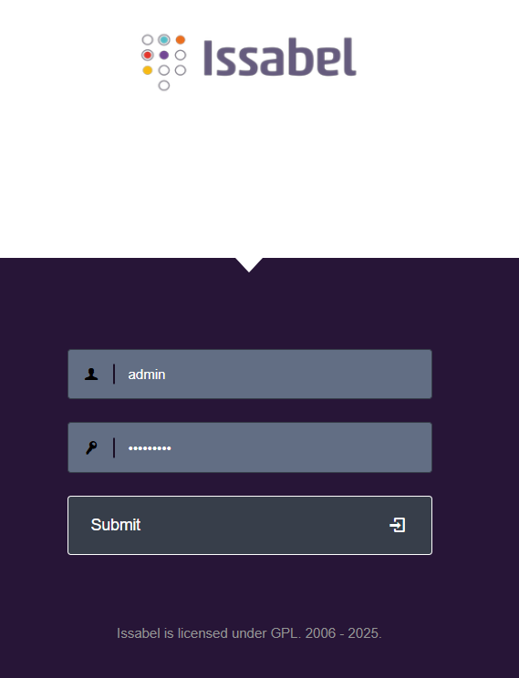
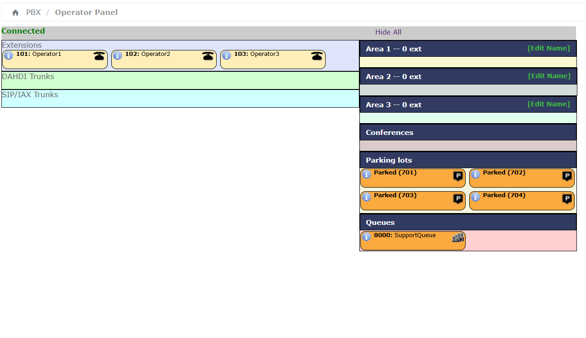

# Курсовая работа 4 курс, 1 семестр

## Задание
1. Используя IAC установить операционную систему
2. На нее установить средство VOIP
3. Установить ip телефоны(минимум 3)
4. Настроить представление телефонов в VOIP
5. Настроить очереди, ожидание.

### Использованный стек
**Инфраструктура как код:**
1. **Vagrant** для описания и автоматического развертывания виртуальной машины с Ububntu 22.04 (Vagrant box ubuntu/jammy64)/
2. В **Vagrantfile** настраиваются ресурсы ВМ (2 vCPU, 4 Gb RAM),<br> приватная сети `192.168.10.10`, hostname `server`, а также shell-provisioner.

### Установка инфраструктурного ПО
- Shell-provisioner Vagrant внутри гостевой Ubuntu автоматически выполняет:
    
    1. обновление пакетов;
    2. установку зависимостей;
    3. подключение официального Docker-репозитория;
    4. Установку Docker Engine, containerd и `docker compose` plugin;
    5. добавление пользователя `vagrant` в группу `docker`.

### Платформа VoIP / Call Center
- **Docker Compose** для развертывания контейнера IP-АТС issabel PBX на базе образа `technoexpress/issabel-pbx`.
- `docker-compose.yml` описывает сервис `issabele`с:
    
    1. пробросом портов SIP (5060/5061 UDP/TCP), RTP (10000–10100), <br>веб‑интерфейса (HTTP 80→880, HTTPS 443→4443) и служебных портов (AMIF 5038, FOP2, SSH и т.д.);
    2. примонтированными именованными томами issabel-etc, issabel-www, <br>issabel-log, issabel-lib, issabel-home для сохранения конфигурации и данных Issabel.

### IP-телефоны и клиенты
- В веб-интерфейсе issabel созданы три SIP-расширения:<br> **101 (Operator1)**, **102 (Operator2)**, **103 (Operator3)** с собственными паролями (`secret`).
- В качестве IP-телефонов используются три SIP-аккаунта в softphone-клиенте MicroSIP на рабочей станции, <br> каждый использует данные SIP-расширения (`101`, `102`, `103`), а также IP-server - `192.168.10.10`, UDP `5060`.

### Логика колл-центра
- В `issabel` настроена очередь **SupportQueue (8000)** со стадией `ringall`,<br> статическими агентами 101/102/103 и классом **Music on Hold** (ожидание).
- Создана **Misc Application** с внутренним кодом `770`, <br>напаравляющим вызовы на **Destination Queues -> 8000:SupportQueue**, <br>что реализует входной номер колл-центра с очередью.

---

## Как запустить
Для запуска всего стека достаточно перейти в директорию с `Vagrantfile` и ввести команду в терминале:
```vagrant
vagrant up --provision
```
Инфраструктура самостоятельно **развернется** и **запустится**, доступ к веб-интерфейсу issabel будет доступен по 80 порту. <br>
Для входа требуется ввести логин и пароль (`admin`/`issabel-4`). <br>



Для того, чтобы можно было пользоваться всеми наработками в самом issabel, <br>необходимо в веб-интерфейсе контейнера перейти в `system -> Backup/Restore`, <br>нажать `Upload` и **выбрать файл из папки backups**. 
<br>После этого можно перейти в `PBX -> Operator Panel` и убедиться, что теперь есть три оператора и ожидание.

